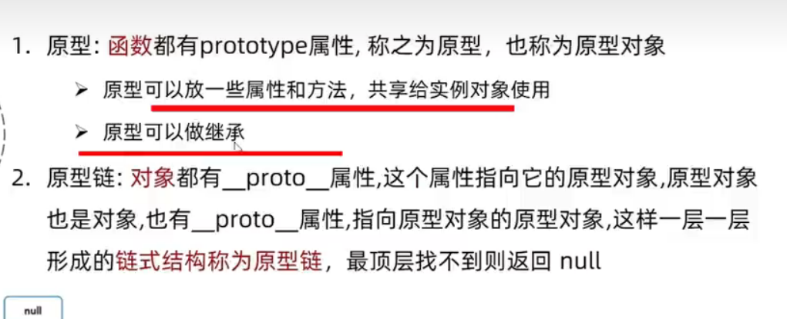

# 收集点面试题(JS 篇)

---

### 1.==`forEach` 中的异步问题==

下面这道题的输出？

```javascript
const square = (num) => {
    return new Promise((resolve, reject) => {
        setTimeout(() => {
            resolve(num * num);
        }, 1000 * num);
    });
};

function test() {
    list.forEach(async (x) => {
        const res = await square(x);
        console.log(res);
    });
}

test();
```

一般会觉得 `forEach` 中会 await 暂停，也就是:

1. 先 3s 后输出 9
2. 再 2s 后输出 4
3. 再 1s 后输出 1

但实际结果是

1. 先 1s 后输出 1
2. 再 1s 后输出 4
3. 再 1s 后输出 9

看起来 **await 并没有暂停 `forEach` 的执行而是直接同时开启三个定时器。**

> 原因在于 `forEach` 内部是同步的，它不会等待异步回调函数返回后才进行下一步，而是一次对所有数组元素进行操作，转而使用普通 for 循环即可解决循环内的异步问题

```javascript
async function test() {
    for (const item of list) {
        const res = await square(item); // 这里会等待 square resolve后才继续进行
        console.log(res); // 先3s 后输出 9 再2s 后输出 4 再1s 后输出 1
    }
}
```

### 2. ==defineProperty 和 Proxy 的区别==

1. `Proxy` 对象用于创建一个对象的代理，从而实现基本操作的拦截和自定义（如属性查找、赋值、枚举、函数调用等）。
2. `defineProperty` 代理的是对象的属性，`Proxy` 代理的是对象。
3. `Proxy` 是创建对象的代理，不会操作原始对象，提供了 set、get、deleteProperty 等处理器，这样就不需要通过调用`Vue.$set` 和 `Vue.$delete` 来触发响应式。
4. `Proxy` 内部实现了对数组的全面监听，不需要因为 `defineProperty` 针对数组的边界情况而放弃对数组的监听。

### 3. ==MVC、MVP、MVVM 的区别==

**除了 MVVM**

1. MVC：

View 的指令给 Controller，Controller 改 Model，Model 通知 View 更新。这样的开发太过于繁琐，要写 MVC 三套独立的代码，维护性并没有提高。

2. MVP：

MVP 是 MVC 的变种，View 的指令给 Presenter ，再由 Presenter 去修改 Model ，再返回来由 Presenter 来更新 View，这样就切断了 View 和 Model 层的直接联系解耦，但这样会导致 P 层过于臃肿，大量的逻辑都堆在 P 层，项目一大就难以维护。

3. MVVM：

MVVM 取消了 controller，也就是 Model 的改变可以被监听，实时改变 View 的表现，开发过程中只需要关注 Model 的数据处理即可。

### 4.==跳出forEach循环==

1. 抛出异常

```js
let arr = [...new Array(10).keys()];
try {
    arr.forEach((item) => {
        console.log(`item:${item}`);
        if (item > 5) throw new Error("break");
    });
} catch (err) {
    // 直接跳出
    if (err.message === "break") console.log("break success!");
    else console.error(err);
}
```

2. 直接 return

```js
arr.forEach((item) => {
    if (item > 5) return;
    console.log(`item:${item}`);
});
```

### 5. ==？？和 || 的区别==

1. ?? 是只有左侧为 `null` 或者 `undefined` 才返回 false
2. || 会优先把左侧转化为布尔型再进行判断

### 6.==原型和原型链==

1. 原型：**函数** 都有的 `prototype` 属性，称为原型，本身是一个 **对象** 所以也叫原型对象。
2. 原型链：**对象** 都有一个 `__proto__` 属性，这个属性指向了其 **构造函数** 的原型对象，而原型对象也是对象，所以它也有 `__proto__` 属性，它又能找到再上一层构造函数的原型对象，这样 **一层层查找形成的链式结构，称为原型链**，查找到顶层后找不到再上一层则返回 null。



### 7.==为什么有箭头函数？==

1. 更简洁的语法，我们可以省略 function、花括号、return，甚至是参数的括号。
2. 更加的灵活，因为箭头函数没有自己的作用域，它继承了它所在的上下文的作用域，这对开发中一些情况就有更灵活的选择，比如 react 中,
