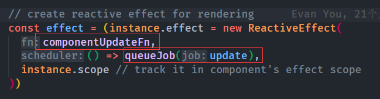
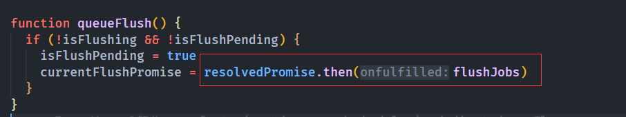
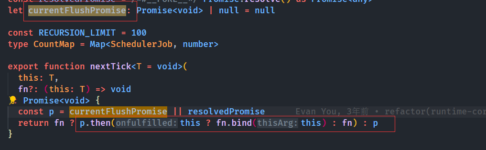

# 收集点面试题(Vue 篇)

---

## 1. ==Vue3 面试题：为什么组件实例只可以在 setup 方法中获取，设计原理是什么？==

在运行组件的 setup 方法**之前**，会把当前运行的组件实例设置在一个全局的变量中：**currentInstance**，运行 setup 方法结束之后就会把当前的全局组件实例变量 currentInstance **设置为空**。所以组件实例只可以在 setup 方法中获取。

## 2. ==Vue 和 React 的区别==

### 3. ==使用 Object.defineProperty 来进行数据劫持有什么缺点==

1. 第一是对象的属性添加删除变化无法被监听到，因为一开始遍历对象并没有这些属性，所以必须使用 `Vue.$set` 和 `Vue.$delete` 才能为后来变更的属性添加上响应式。
2. `defineProperty` 实现数据劫持的原理主要是对某个属性的 getter 和 setter 操作进行拦截，这就导致想要监听整个对象的属性变化需要递归遍历，性能开销大。
3. `defineProperty` 可以监视数组下标，但是需要遍历整个数组，这样的性能开销非常大，并且用户这样操作的次数也不多。

#### 4. ==nextTick 原理==

1. vue 采用 **异步更新策略**，就是说同一个事件循环中更新的数据会被缓存到一个队列中，同步代码全部执行完了才会去刷新队列触发组件更新函数，而刷新队列采用的是 Promise 异步的方法，也就是包裹在一个 Promise 的 then 中刷新队列。
    1. 下图就是将组件更新函数推入队列以及以 then 的方法刷新队列
    2. 
    3. 
2. 因此，同步代码中修改完一个 **响应式数据** 此时其对应的 dom 还没有被修改，所以拿到的还是旧值。
3. nextTick 的原理就是，在 1 的基础上，拿到刷新队列的这个 Promise，然后再其 then 方法中，执行 nextTick 的回调函数，此时之前的所有组件更新函数肯定已经执行完了，所以此时的 dom 已经是最新的。

