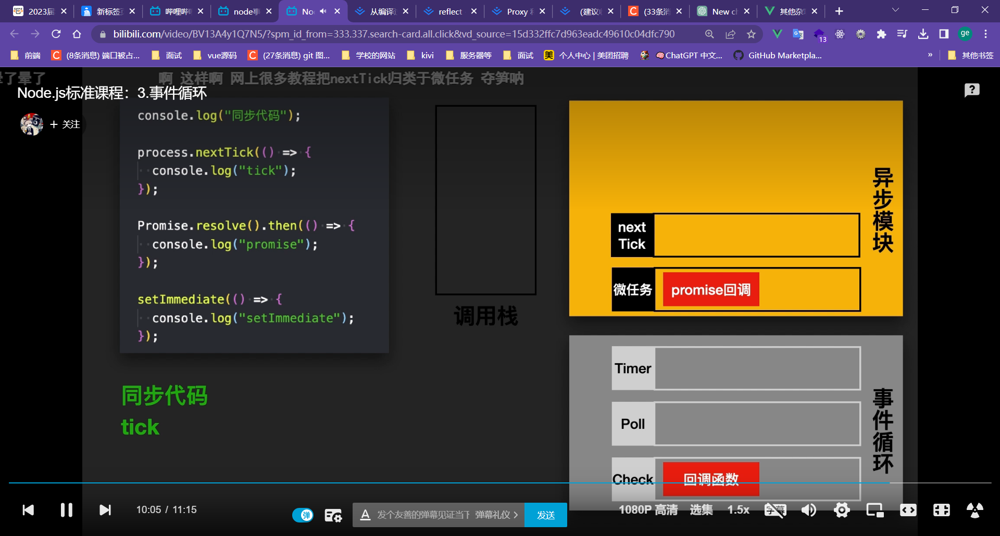

# 美团一面

1. 自我介绍

2. 怎么学习的前端？

3. 挑一个你做的好的项目介绍一下

4. **worker线程**

5. 做组件库是出于什么想法？

6. 组件库最大的挑战是什么

7. **你认为你的组件库和 element-plus 的区别是什么**

8. **你认为开发一个表单组件有哪些技术点和比较重要的实现**
    1. 数据双向绑定：表单组件需要能够将用户的输入值绑定到组件的数据模型中，同时也需要能够将组件数据模型中的值绑定到表单控件上，这就需要使用 Vue 的双向数据绑定技术。
    2. 自定义事件：在表单组件中，当用户输入数据时，需要及时触发相应的事件，如输入框的change事件、复选框的click事件等。因此，需要为组件定义自定义事件，并在相应的操作中触发这些事件，以实现组件和父组件之间的通信。
    3. 插槽（slot）：表单组件的样式和结构可能会因为使用场景的不同而有所不同，这时就需要使用插槽来实现灵活的组件结构，将组件的部分内容交由用户自定义。
    4. 表单验证：表单组件需要对用户的输入进行验证，以确保输入的数据符合预期的格式和要求。可以使用 **Vue 的计算属性或者watch** 来监听组件数据模型中的值变化，并根据需要触发相应的验证逻辑。

9. 如果表单用户传入初始值，我需要随时可以重置会初始值，怎么实现

10. 用过哪些状态管理的库？

11. **vuex 和 pinia 的区别？**

12. vuex 和 pinia 源码有了解过吗？

13. **vue 的核心实现原理介绍一下，说一下 2 3的区别**

14. vue3 在数据处理(比如数组，对象添加新属性)上和vue2的区别

15. 了解过其它哪些框架

16. 举几个常用的数组方法

17. reduce的使用场景？

18. foreach 和 map 的区别？

19. js 中，堆和栈分别储存了什么数据？

20. 说一下引用数据类型和基础数据类型各有哪些

21. **node的事件循环和浏览器的事件循环什么区别？**

     1. node 

     

     2. 浏览器就宏任务微任务

22. 如何开启一个 node 服务？原生 and express

23. 原生 js 如何绑定和删除事件，如何做事件委托？

24. 如何通过事件的 event 获取点击的 dom 对象？

25. **如何用 promise 实现同时发两个请求？**

26. promise.all 和 promise.allsettled 的区别

27. 说一说 promise 的实现

28. 说一说开发过程中啥时候会用到泛型

29. **说一说 typescript 的类型推断机制**

30. **如果用 const 定义变量可以不赋初始值吗？为什么不行？**
      1. 因为 const 是只读的，后续不可修改，所以必须有初值

31. **如何实现 强缓存 和 协商缓存？**

      1. 响应头携带 cache-controll 即可开启强缓存
          1. 在 max-age 有效期内，请求同一资源会直接读取缓存。
      2. 协商缓存就是当浏览器请求有缓存的资源时，先经过 max-age 判断该缓存是否已经过期，如果过期就会判断该资源
          1. 是否有 **Etag** 和 **Last-Modified** 属性，如果有就带着 **If-None-Match** 和 **Modified-since** 字段向服务端发起请求验证该缓存是否过期，如果过期了服务端就会发送新的资源以状态码 200 和 **Etag** 以及 **Last-Modified** 属性，如果没有过期就返回状态码 304 标识未过期继续使用缓存。
          2. 如果没有 **Etag** 和 **Last-Modified** 属性那么就会直接向服务器发起新的 Http 请求获取最新的资源。

32. **那些协议属性会触发缓存？**

      1. **Cache-Control**：指示客户端和缓存服务器如何缓存响应。例如，max-age指令指示客户端和缓存服务器在指定时间内缓存响应。
      2. **Expires**：指定响应的过期时间。过期时间之前，客户端和缓存服务器可以使用缓存的响应。
      3. **ETag**：指定响应实体的标识符，如果响应实体没有发生变化，则可以使用缓存的响应。
      4. **Last-Modified**：指定响应实体的最后修改时间，如果响应实体自上次访问以来没有更改，则可以使用缓存的响应。

      当客户端或缓存服务器收到带有这些属性的响应时，它们可以将响应存储在缓存中。在下一次请求相同的URL时，客户端或缓存服务器可以使用缓存的响应，而不是向服务器发送请求。这可以提高性能并减少网络流量。

33. **说说前端的跨域问题**

      1. JsonP，实现方法为前端在全局内存储一个回调函数，用于接收服务端返回的数据，然后向服务端发起请求，在最后跟上类似 ?callback=fn，服务端就会返回这个函数的调用，这样就在这个全局的回调函数中拿到服务端的数据。
      2. CORS，后端设置 **`Access-Control-Allow-Origin`**，对于复杂请求呢，我们需要发送一个预检请求，需要携带 `Access-Control-Request-Method & Access-Control-Request-Headers`，如果返回值有 `Access-Control-Allow-xxx` 那就应该是可以，如果想要跨域保存 Cookie 
          1. 请求头携带 `withCredentials` 字段设置为 true，
          2. 响应头携带 `Access-Control-Allow-Credentials` true，并携带 `set-cookie` 字段
          3. 响应头中设置：`Access-Control-Allow-Origin` 设置为非 `*`
      3. 本地服务代理，比如 webpack 和 vite 的 devServer

34. 如何实现元素的垂直水平居中？

35. rem em vh vm 的区别

36. **http 和 https 的区别**

37. **ssl 是在 tcp/ip 协议哪一层？**

38. **四层协议是哪四层**

39. **证书在什么情境下使用？**

40. **了解 ssl 的加密过程吗？**

41. linux 如何搜索一些特定内容要求的文件？

42. 如何用 nodejs 实现？

43. **vite 和 webpack 的区别**

      1. webpack 采用的是传统的 **bundle** 打包的构建形式，它会把各个模块整合到几个文件中进行输出，在这个过程中会对**模块依赖图**进行构建和分解成浏览器可以识别的文件。
      2. vite 的原理是 **unbundle** 机制，也就是不需要模块依赖图，而依靠浏览器原生的 ESM 规范来解析需要的文件。
      3. vite 之所以快是因为它不会像 webpack 那样全量打包所有的东西，再开启开发服务器，而是按需加载，也就是用到了再向服务器发起请求获取资源。
      4. 基于 3，vite 在首屏加载和懒加载方面表现会差一点，因为 vite 把文件的解析转化放到了请求的时候，这就会导致在没有缓存的情况下引入一个新文件，不但要现转化，还有大量的 http 请求，所以会很慢。

**看一下预构建**

44. webpack 的 loader 和 plugin 的区别
45. 手写 flat
46. 手写 chunk